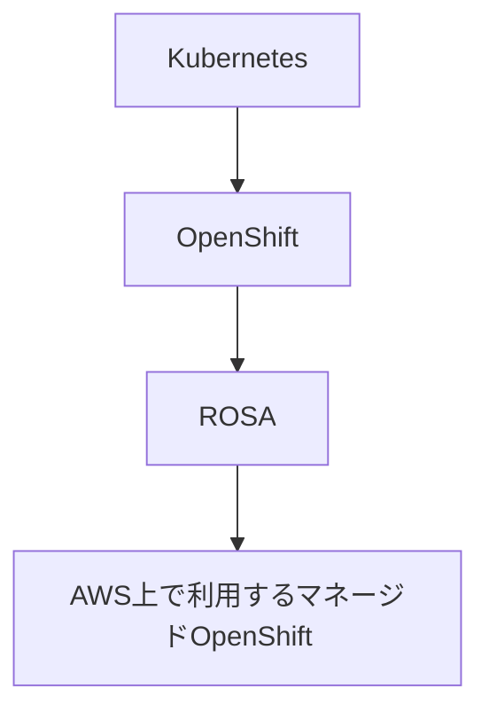

# 05. ROSA の基本

## ROSA とは

**Red Hat OpenShift Service on AWS** の略。  
AWS 上で Red Hat OpenShift を利用できるマネージドサービス。

現場の AWS 上マネージド OpenShift = ROSA、という位置づけで覚える。



| 用語 | 意味 |
|------|------|
| Kubernetes | コンテナを管理する基盤 |
| OpenShift | Kubernetes を企業向けに強化したプラットフォーム |
| ROSA | AWS 上で使えるマネージド OpenShift |

## なぜ最後に学ぶか

ROSA は「OpenShift そのもの」＋「AWS の土台」の理解が前提です。

```text
Kubernetes
  ↓
OpenShift
  ↓
AWS の基礎
  ↓
ROSA
```

## 学ぶこと（Docs 中心の学習チェック）

ハンズオン用の有料クラスタが無い場合は、**ドキュメントを読みながらメモを取る**学習になります。

### 1. ROSA の全体像

- [ ] 誰がコントロールプレーンを管理するか（マネージドの意味）
- [ ] クラスタ作成の大まかな流れ（アカウント連携 → クラスタ → アプリ）

読む:
- https://aws.amazon.com/jp/rosa/
- https://www.redhat.com/en/technologies/cloud-computing/openshift/aws/learn

### 2. AWS 側で出てくる部品

| AWS | ざっくり役割 |
|-----|----------------|
| VPC | ネットワークの箱 |
| IAM | 権限 |
| Load Balancer | 外からの入口 |
| CloudWatch | 監視・ログ |
| ECR | コンテナレジストリ（使う場合） |
| Route 53 | DNS |

- [ ] 上記を「OpenShift/ROSA のどの層と関係しそうか」一言で書ける

### 3. 運用・セキュリティの観点（現場接続）

- [ ] 監視（何を見るか）
- [ ] 権限（誰がクラスタを触れるか）
- [ ] 障害時の切り分け（アプリ / OpenShift / AWS）

## 任意ハンズオン（環境がある場合）

実クラスタがある場合のみ:

```bash
oc login ...
oc get nodes
oc get co          # cluster operators
oc get route -A
```

AWS Console では VPC / LB / IAM ロールを眺めて、「Docs の図と実物」を対応づける。

## 章のゴール

- [ ] ROSA を「AWS 上のマネージド OpenShift」と説明できる
- [ ] K8s → OpenShift → ROSA の依存関係を説明できる
- [ ] AWS の主要コンポーネントと OpenShift の接点を列挙できる

戻る: [リポジトリ README](../README.md)
