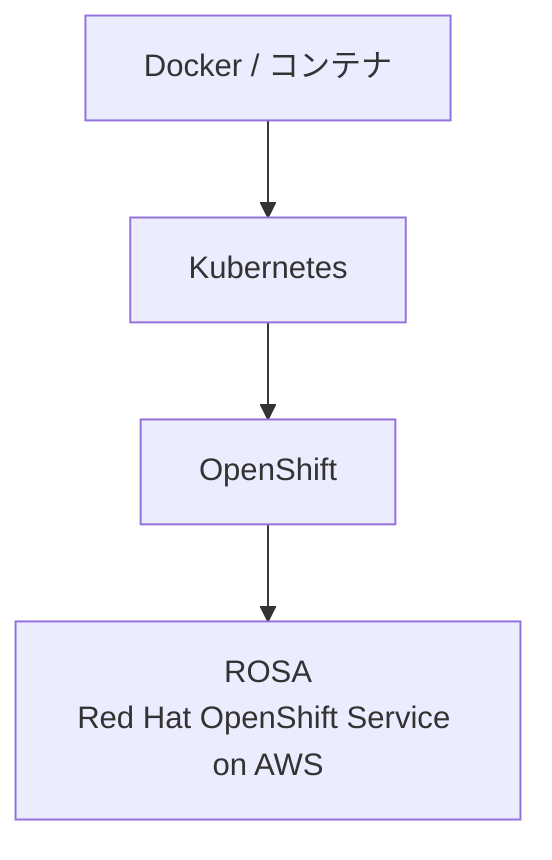
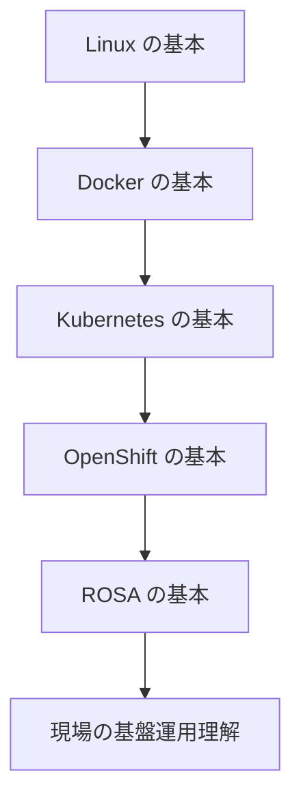

# Kubernetes / OpenShift / ROSA ハンズオン学習

Docker → Kubernetes → OpenShift → ROSA の順で、手を動かしながら学ぶためのリポジトリです。

## 全体像



| 技術 | 一言でいうと |
|------|----------------|
| Docker | アプリをコンテナ化する技術 |
| Kubernetes | コンテナを自動管理する仕組み |
| OpenShift | Kubernetes を企業向けに強化したもの |
| ROSA | AWS 上で使うマネージド OpenShift |

## 推奨学習順



| Step | 学習内容 | 使用環境 | ディレクトリ |
|------|----------|----------|----------------|
| 0 | 全体像・用語の整理 | この README | [00-overview](./00-overview/) |
| 1 | Linux の基本 | ローカル / WSL | [01-linux](./01-linux/) |
| 2 | Docker の基本 | Docker Desktop | [02-docker](./02-docker/) |
| 3 | Kubernetes の基本 | Minikube | [03-kubernetes](./03-kubernetes/) |
| 4 | OpenShift の基本 | Developer Sandbox | [04-openshift](./04-openshift/) |
| 5 | ROSA の基本 | Docs +（任意）実クラスタ | [05-rosa](./05-rosa/) |

## 自分の学習方針（このリポジトリの前提）

1. **Kubernetes** … Minikube でローカルハンズオン
2. **OpenShift** … Developer Sandbox で Web Console / `oc` を体験
3. **ROSA** … OpenShift 理解のあと、AWS / Red Hat ドキュメントで構成を学ぶ

```text
Kubernetes
  ↓
OpenShift
  ↓
Red Hat OpenShift Documents
  ↓
AWS ROSA Documents
```

## 使い方

1. 上の Step を順番に進める
2. 各ディレクトリの `README.md` を読む
3. 「ハンズオン」節のコマンドを実行する
4. 最後のチェックリストで理解を確認する

概念の長い説明は [docs/concepts.md](./docs/concepts.md) にまとめています。

## 参考リンク（公式）

- [Kubernetes Tutorials（日本語）](https://kubernetes.io/ja/docs/tutorials/)
- [Red Hat OpenShift on AWS Learn](https://www.redhat.com/en/technologies/cloud-computing/openshift/aws/learn)
- [AWS ROSA](https://aws.amazon.com/jp/rosa/)
