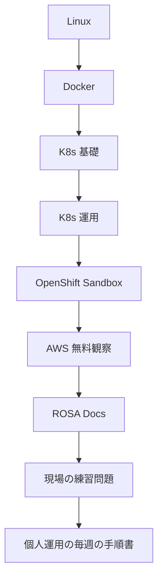

# Kubernetes / OpenShift / ROSA 実習学習

Docker → Kubernetes → OpenShift → ROSA の順で、**無料の範囲だけ**で手を動かし、最終的に **個人で検証環境を運用できる**状態を目指します。

## 無料枠の方針（必須）

このリポジトリの全手順は、次の範囲に限定しています。

| 使ってよいもの | 使ってはいけないもの |
|----------------|----------------------|
| ローカル PC / WSL | 有料クラウド VM の常用 |
| Docker Desktop（個人利用）または Colima 等 | 課金前提のマネージド DB 等 |
| Minikube | EKS / 有料 Kubernetes |
| [Developer Sandbox](https://developers.redhat.com/developer-sandbox)（無料・期限あり） | **ROSA クラスタ作成**（有料） |
| AWS 管理画面（Console）の**閲覧**と IAM の学習（料金 $0 の操作のみ） | NAT Gateway / ALB / ROSA / 常時起動 EC2 |
| 公式 Docs | 「試しに作る」有料のもの / 資源 |

詳細・禁止リスト・代替手段: [docs/free-tier.md](./docs/free-tier.md)

> ROSA 実クラスタは無料では作れません。  
> **OpenShift 操作は Sandbox、ROSA 固有知識は Docs + 責任分界演習**で代替し、個人運用は **Minikube + Sandbox** で回します。

## 到達レベル

| レベル | できること | 対応 Step |
|--------|------------|-----------|
| L1 | ローカルで配置して動かす・基本操作 | 0–3 |
| L2 | 壊して直す・Probe/RBAC の型 | 4 |
| L3 | OpenShift 差分を Sandbox で一人で扱う | 5 |
| L4 | 無料検証環境を週次で自分運用できる | 6–9 |

ゴール（L4）: **Minikube + Developer Sandbox を自分の手で健全に回し、障害初動と週次点検を一人で実施できる。**  
ROSA 本番相当の構築運用は対象外（有料のため）。知識としては説明・切り分けができるところまで。

## 推奨学習順

| Step | 内容 | 環境（無料） | ディレクトリ |
|------|------|--------------|----------------|
| 0 | 全体像・到達像 | Docs | [00-overview](./00-overview/) |
| 1 | Linux | ローカル / WSL | [01-linux](./01-linux/) |
| 2 | Docker | Docker Desktop / Colima | [02-docker](./02-docker/) |
| 3 | Kubernetes 基礎 | Minikube | [03-kubernetes](./03-kubernetes/) |
| 4 | Kubernetes 運用 | Minikube | [04-kubernetes-ops](./04-kubernetes-ops/) |
| 5 | OpenShift | Developer Sandbox | [05-openshift](./05-openshift/) |
| 6 | AWS 基礎 | 管理画面（Console）閲覧のみ | [06-aws](./06-aws/) |
| 7 | ROSA | Docs のみ（クラスタ作成禁止） | [07-rosa](./07-rosa/) |
| 8 | 現場の練習問題 | ノート + 無料環境 | [08-field-ops](./08-field-ops/) |
| 9 | 個人運用（週次） | Minikube + Sandbox | [09-personal-ops](./09-personal-ops/) |

目安: Step 0–5 で 1〜2 週間、6–8 で数日、9 は継続（週 30〜60 分）。

## 各 Step の進め方

1. README の **前提** を満たす
2. **実習** を上から実行する（各コマンドに **意味・目的** を併記）
3. 「なぜこのコマンドか」を口に出してから打つと定着しやすい
4. **期待結果** と自分の画面を照合する
5. **完了条件（DoD）** を全部チェックしてから次へ
6. うまくいかないときは各 Step の **うまくいかないとき** の節を見る

概念の詳細: [docs/concepts.md](./docs/concepts.md)  
無料枠: [docs/free-tier.md](./docs/free-tier.md)  
ことばの案内（用語の言い換え）: [docs/kotoba.md](./docs/kotoba.md)

## 参考リンク（公式）

- [Kubernetes Tutorials（日本語）](https://kubernetes.io/ja/docs/tutorials/)
- [Developer Sandbox](https://developers.redhat.com/developer-sandbox)
- [Red Hat OpenShift on AWS Learn](https://www.redhat.com/en/technologies/cloud-computing/openshift/aws/learn)
- [AWS ROSA（Docs・製品説明）](https://aws.amazon.com/jp/rosa/)
