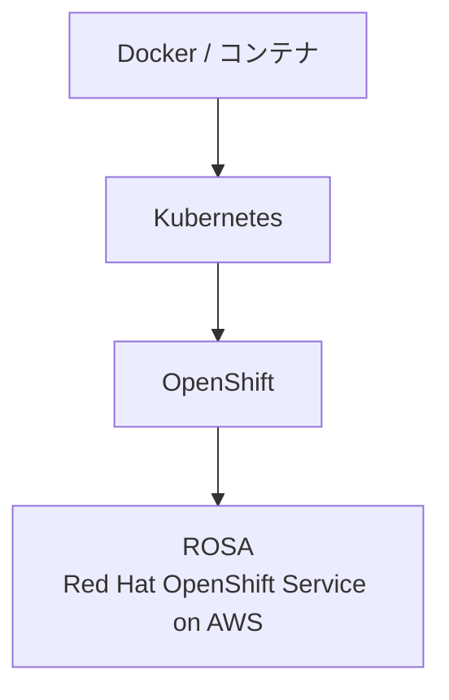
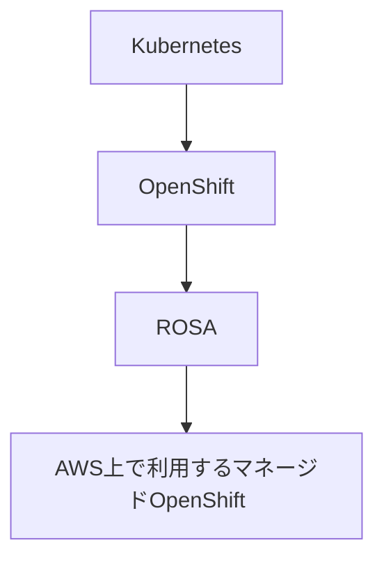
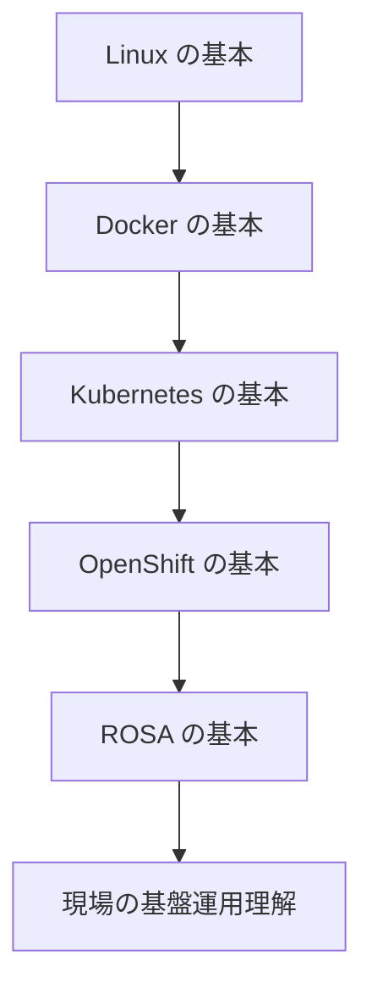

# Kubernetes / OpenShift / ROSA 学習メモ

## 全体像



---

# Kubernetes

## Kubernetes とは

Kubernetes は、Linux サーバー上でコンテナ化したアプリケーションを、複数のサーバー上で自動管理するための仕組み。

コンテナの起動、停止、再起動、スケーリング、配置などを自動で管理してくれる。

## 例えて説明すると

| 用語                 | 例え                                       |
| -------------------- | ------------------------------------------ |
| コンテナ化したアプリ | 完成済みの料理キット                       |
| サーバー             | 店舗の厨房                                 |
| Kubernetes           | 店舗全体を管理する店長・エリアマネージャー |

つまり、Kubernetes は「どの厨房で、どの料理キットを、どれくらい動かすか」を管理する仕組み。

## 学習領域

- Linux
- Docker
- Kubernetes の基本概念

## 学習方法

ローカル PC 上で Kubernetes を動かせる **Minikube** を使って、ハンズオン形式で学習する。

## 参考ドキュメント

- Kubernetes Tutorial Documents  
  https://kubernetes.io/ja/docs/tutorials/

---

# OpenShift

## OpenShift とは

OpenShift は、企業向けに強化された Kubernetes。

Kubernetes を企業で利用する際に必要になりやすい周辺機能をまとめて持っているプラットフォーム。

例えば、以下のような機能が Kubernetes に追加されている。

- Web コンソール
- 開発者向けの操作画面
- 認証・認可
- セキュリティ機能
- CI/CD 連携
- イメージ管理
- 運用管理機能

## 例えて説明すると

| 用語       | 例え                                               |
| ---------- | -------------------------------------------------- |
| Kubernetes | 店舗全体を管理する店長・エリアマネージャー         |
| OpenShift  | 大手チェーン店向けの本部システム付き運営パッケージ |

OpenShift は、Kubernetes をそのまま使うよりも、企業利用しやすいように機能が整備されたもの。

---

## OpenShift の種類・呼称

| 名前                                    | ざっくり意味                                         |
| --------------------------------------- | ---------------------------------------------------- |
| Red Hat OpenShift                       | OpenShift 製品群全体の総称                           |
| OpenShift Container Platform / OCP      | 自社環境やクラウド上に構築して使う代表的な OpenShift |
| OpenShift Dedicated                     | Red Hat が管理する専用 OpenShift                     |
| Red Hat OpenShift Service on AWS / ROSA | AWS 上のマネージド OpenShift                         |
| Azure Red Hat OpenShift / ARO           | Azure 上のマネージド OpenShift                       |
| OpenShift Local                         | ローカル PC で学習・開発用に動かす OpenShift         |
| Developer Sandbox                       | ブラウザで試せる学習用 OpenShift 環境                |

---

# ROSA

## ROSA とは

ROSA は **Red Hat OpenShift Service on AWS** の略。

AWS 上で Red Hat OpenShift を利用できるマネージドサービス。

現在の現場で使用している AWS 上のマネージド OpenShift が ROSA。

## 位置づけ



## ざっくり説明

| 用語       | 意味                                            |
| ---------- | ----------------------------------------------- |
| Kubernetes | コンテナを管理する基盤                          |
| OpenShift  | Kubernetes を企業向けに強化したプラットフォーム |
| ROSA       | AWS 上で使えるマネージド OpenShift              |

---

# 学習領域

## Kubernetes を学ぶために必要な知識

- Linux
- Docker
- Kubernetes の基本
  - Pod
  - Deployment
  - Service
  - Namespace
  - ConfigMap
  - Secret
  - Ingress / Route

## OpenShift を学ぶために必要な知識

- Kubernetes の基本
- OpenShift 独自の概念
  - Project
  - Route
  - BuildConfig
  - ImageStream
  - DeploymentConfig
  - Web Console
  - Operator
- セキュリティ
- 権限管理
- 基盤運用知識

## ROSA を学ぶために必要な知識

- Kubernetes
- OpenShift
- AWS
  - VPC
  - IAM
  - Load Balancer
  - CloudWatch
  - ECR
  - Route 53
- 基盤運用知識

---

# 学習の進め方

## 1. Kubernetes の基本を学ぶ

まずは Kubernetes の基本概念を理解する。

学習環境としては、ローカル PC で Kubernetes を動かせる **Minikube** を使う。

### 学ぶ内容

- Kubernetes とは何か
- Pod
- Deployment
- Service
- Namespace
- kubectl の基本操作

### 参考ドキュメント

- Kubernetes Tutorial Documents  
  https://kubernetes.io/ja/docs/tutorials/

---

## 2. OpenShift を学ぶ

次に、Kubernetes を企業向けに拡張した OpenShift を学ぶ。

学習環境としては、ブラウザから無料で試せる **Developer Sandbox** を使用する。

### Developer Sandbox とは

Developer Sandbox は、OpenShift を無料で試せる学習・検証用の環境。

ローカル PC に OpenShift を構築しなくても、ブラウザ上から OpenShift の操作を体験できる。

### 学ぶ内容

- OpenShift と Kubernetes の違い
- OpenShift Web Console
- Project
- Route
- Build
- Deployment
- Operator
- OpenShift CLI / oc コマンド

### 参考ドキュメント

- Red Hat OpenShift Documents  
  https://www.redhat.com/en/technologies/cloud-computing/openshift/aws/learn

---

## 3. ROSA を学ぶ

最後に、OpenShift を AWS 上で利用する ROSA について学ぶ。

ROSA は、Red Hat OpenShift を AWS 上でマネージドサービスとして利用するもの。

そのため、以下の順番で学ぶと理解しやすい。

```txt
Kubernetes
↓
OpenShift
↓
AWS の基礎
↓
ROSA
```

### 学ぶ内容

- ROSA とは何か
- AWS 上で OpenShift を使う仕組み
- ROSA クラスターの構成
- ネットワーク
- IAM
- 運用監視
- セキュリティ
- 障害対応

### 参考ドキュメント

- AWS ROSA Documents  
  https://aws.amazon.com/jp/rosa/

- Red Hat OpenShift on AWS Learn  
  https://www.redhat.com/en/technologies/cloud-computing/openshift/aws/learn

---

# 学習順序まとめ

## 推奨学習順



## 学習ステップ

| Step | 学習内容          | 使用環境                       |
| ---- | ----------------- | ------------------------------ |
| 1    | Linux の基本      | ローカル PC / WSL / Linux 環境 |
| 2    | Docker の基本     | Docker Desktop                 |
| 3    | Kubernetes の基本 | Minikube                       |
| 4    | OpenShift の基本  | Developer Sandbox              |
| 5    | ROSA の基本       | AWS / Red Hat Docs             |
| 6    | 現場理解          | 実際のプロジェクト環境         |

---

# まず理解したい関係性

```txt
Docker
  ↓
コンテナを作る技術

Kubernetes
  ↓
コンテナを複数サーバー上で管理する技術

OpenShift
  ↓
Kubernetes を企業向けに強化したプラットフォーム

ROSA
  ↓
AWS 上で使えるマネージド OpenShift
```

---

# ざっくり一言でまとめる

| 技術       | 一言でいうと                        |
| ---------- | ----------------------------------- |
| Docker     | アプリをコンテナ化する技術          |
| Kubernetes | コンテナを自動管理する仕組み        |
| OpenShift  | Kubernetes を企業向けに強化したもの |
| ROSA       | AWS 上で使う OpenShift              |

---

# 自分の学習方針

## Kubernetes

Minikube を使い、ローカル PC でハンズオンしながら学習する。

## OpenShift

Developer Sandbox を使い、OpenShift の Web Console や `oc` コマンドを触りながら学習する。

## ROSA

Red Hat OpenShift の理解を深めたあと、AWS ドキュメントを確認し、AWS 上で OpenShift を使う流れを学習する。

学習順は以下の通り。

```txt
Kubernetes
↓
OpenShift
↓
Red Hat OpenShift Documents
↓
AWS ROSA Documents
```
