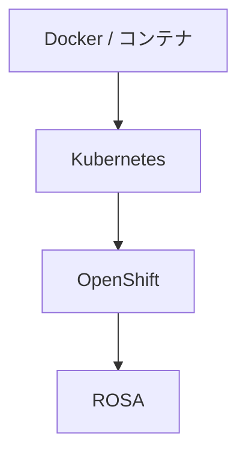

# 概念メモ（用語・詳細説明）

各 Step の README はハンズオン中心。長い説明はここに集約する。  
無料枠の約束: [free-tier.md](./free-tier.md)

---

## 全体像と到達レベル

| レベル | 意味 | 無料での実現 |
|--------|------|----------------|
| L1 | デプロイできる | Minikube |
| L2 | 壊して直せる | Minikube |
| L3 | OpenShift 差分を扱える | Developer Sandbox |
| L4 | 週次で自分運用できる | Minikube + Sandbox + ランブック |

ROSA 実クラスタ作成は有料のため L4 の対象外。知識は Docs + 責任分界まで。

| 技術 | 一言 |
|------|------|
| Docker | コンテナ化 |
| Kubernetes | コンテナ自動管理 |
| OpenShift | 企業向け Kubernetes プラットフォーム |
| ROSA | AWS 上マネージド OpenShift |

---

## Kubernetes

| 概念 | 意味 |
|------|------|
| Pod | 最小実行単位 |
| Deployment | 台数・更新 |
| Service | 安定したアクセス口 |
| Namespace | 仕切り |
| ConfigMap / Secret | 設定・機密 |
| Ingress | 外部 HTTP（OpenShift では Route が多い） |
| Events | 障害切り分けの入口 |
| Probe | readiness / liveness |
| requests / limits | 予約と上限 |
| PVC | 永続ディスク要求 |
| RBAC | API 権限 |
| NetworkPolicy | Pod 間ファイアウォール（概要） |

環境: Minikube（無料）

---

## OpenShift

| 用語 | 意味 |
|------|------|
| Project | Namespace + 権限など |
| Route | 外部公開 |
| BuildConfig / ImageStream | ビルド・イメージ参照 |
| DeploymentConfig | レガシー寄り |
| SCC | Pod セキュリティ制約 |
| Operator | 運用の自動化拡張 |

学習環境: **Developer Sandbox（無料・期限あり）**  
有料 OCP / ROSA クラスタは教材手順に含めない。

---

## AWS（観察）

| 部品 | 接点 |
|------|------|
| VPC / Subnet | ノードのネットワーク |
| IAM / STS | 権限 |
| LB | API / Route 入口 |
| Route 53 | DNS |
| CloudWatch | 監視 |

作成禁止の目安: ROSA、NAT、ALB/NLB、常時 EC2。詳細は free-tier.md。

---

## ROSA

マネージド OpenShift on AWS。

| Classic | HCP |
|---------|-----|
| 従来型 | コントロールプレーンホスト型 |

学習: Docs + Sandbox での OpenShift 操作の翻訳。クラスタ作成はしない。

責任分界: アプリ / OpenShift・ROSA / AWS
